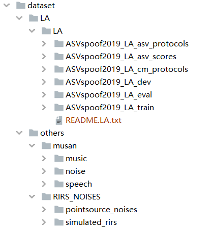

# README

This repository is a modification version of the project [AIR-ASVspoof](https://github.com/yzyouzhang/AIR-ASVspoof) on GitHub. The newly features added are data augmentation experiments and results visualization. The whole project serves as the experimental part for the final year project.

## Requirements

python==3.6

pytorch==1.1.0

## Data Preparation

The original audio data without augmentation of ASVspoof 2019 LA subset can be downloaded from [datashare](https://datashare.ed.ac.uk/handle/10283/3336) (dev/eval/train data are not attached due to the large size, and only protocol and scores). To implement data augmentation, remember to download MUSAN and RIR_NOISES data sets as well from [openslr](http://www.openslr.org/resources.php). The complete directory structure for the dataset is shown below:



The LFCC features are extracted with the MATLAB implementation provided by the ASVspoof 2019 organizers. Please first run the `process_LA_data.m` with MATLAB, and then run `python3 reload_data.py` with python.
Make sure you change the directory path to the path on your machine.

## Run the training code

Before running the `train.py`, please change the `path_to_database`, `path_to_features`, `path_to_protocol` according to the files' location on your machine.

```
python train.py --add_loss ocsoftmax -o ./models/ocsoftmax/ --gpu 0
python train.py --add_loss ocsoftmax -o ./models/ocsoftmax/ --gpu 0 --continue_training
```

## The visualization of the validation set

```
python validate.py -m ./models/ocsoftmax/ -l ocsoftmax --gpu 0
```

## Run the test code with trained model

You can change the `model_dir` to the location of the model you would like to test with.

```
python test.py -m ./models/ocsoftmax/ -l ocsoftmax --gpu 0
```

## Citation

```
@ARTICLE{zhang2021one,
  author={Zhang, You and Jiang, Fei and Duan, Zhiyao},
  journal={IEEE Signal Processing Letters}, 
  title={One-Class Learning Towards Synthetic Voice Spoofing Detection}, 
  year={2021},
  volume={28},
  number={},
  pages={937-941},
  abstract={Human voices can be used to authenticate the identity of the speaker, but the automatic speaker verification (ASV) systems are vulnerable to voice spoofing attacks, such as impersonation, replay, text-to-speech, and voice conversion. Recently, researchers developed anti-spoofing techniques to improve the reliability of ASV systems against spoofing attacks. However, most methods encounter difficulties in detecting unknown attacks in practical use, which often have different statistical distributions from known attacks. Especially, the fast development of synthetic voice spoofing algorithms is generating increasingly powerful attacks, putting the ASV systems at risk of unseen attacks. In this work, we propose an anti-spoofing system to detect unknown synthetic voice spoofing attacks (i.e., text-to-speech or voice conversion) using one-class learning. The key idea is to compact the bona fide speech representation and inject an angular margin to separate the spoofing attacks in the embedding space. Without resorting to any data augmentation methods, our proposed system achieves an equal error rate (EER) of 2.19% on the evaluation set of ASVspoof 2019 Challenge logical access scenario, outperforming all existing single systems (i.e., those without model ensemble).},
  keywords={},
  doi={10.1109/LSP.2021.3076358},
  ISSN={1558-2361},
  month={},}
```